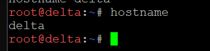

1. set hostname untuk semua client dan jalain di console: <br>
   ```bash
   echo "rootkid" > /etc/hostname
   hostname rootkid
    ```
        
   ```bash
   echo "alpha" > /etc/hostname
   hostname alpha
    ```

   ```bash
   echo "beta" > /etc/hostname
   hostname beta
    ```

   ```bash
   echo "gamma" > /etc/hostname
   hostname gamma
    ```

   ```bash
   echo "delta" > /etc/hostname
   hostname delta
    ```

   ```bash
   echo "epsilon" > /etc/hostname
   hostname epsilon
    ```

   ```bash
   echo "prab" > /etc/hostname
   hostname prab
    ```

   ```bash
   echo "tedd" > /etc/hostname
   hostname tedd
    ```

   ```bash
   echo "abbey" > /etc/hostname
   hostname abbey
    ```

   ```bash
   echo "penny" > /etc/hostname
   hostname penny
    ```

   ```bash
   echo "obladi" > /etc/hostname
   hostname obladi
    ```

   ```bash
   echo "desmond" > /etc/hostname
   hostname desmond
    ```

   ```bash
   echo "oblada" > /etc/hostname
   hostname oblada
    ```

   ```bash
   echo "molly" > /etc/hostname
   hostname molly
    ```

2. screenshot hostname
   

3. perbarui dns prabowo di script.sh
   ```bash
   #!/bin/bash

    # 1. Install BIND9
    apt-get update
    apt-get install -y bind9 bind9utils

    # 2. Buat folder zone
    mkdir -p /etc/bind/jarkom

    # 3. Buat named.conf.local
    echo 'zone "K57.com" {' > /etc/bind/named.conf.local
    echo '    type master;' >> /etc/bind/named.conf.local
    echo '    file "/etc/bind/jarkom/K57.com";' >> /etc/bind/named.conf.local
    echo '    notify yes;' >> /etc/bind/named.conf.local
    echo '    also-notify { 10.92.1.3; };' >> /etc/bind/named.conf.local
    echo '    allow-transfer { 10.92.1.3; };' >> /etc/bind/named.conf.local
    echo '};' >> /etc/bind/named.conf.local

    # 4. Buat File Zone K57.com (Lengkap seluruh Hostname)
    echo '$TTL 604800' > /etc/bind/jarkom/K57.com
    echo '@ IN SOA prab.K57.com. root.K57.com. ( 2026092902 604800 86400 2419200 604800 )' >> /etc/bind/jarkom/K57.com
    echo '@ IN NS prab.K57.com.' >> /etc/bind/jarkom/K57.com
    echo '@ IN NS tedd.K57.com.' >> /etc/bind/jarkom/K57.com
    echo '@ IN A 10.92.3.2' >> /etc/bind/jarkom/K57.com
    echo 'prab IN A 10.92.1.2' >> /etc/bind/jarkom/K57.com
    echo 'tedd IN A 10.92.1.3' >> /etc/bind/jarkom/K57.com
    echo 'abbey IN A 10.92.2.2' >> /etc/bind/jarkom/K57.com
    echo 'penny IN A 10.92.3.2' >> /etc/bind/jarkom/K57.com
    echo 'alpha IN A 10.92.4.2' >> /etc/bind/jarkom/K57.com
    echo 'beta IN A 10.92.4.3' >> /etc/bind/jarkom/K57.com
    echo 'gamma IN A 10.92.4.4' >> /etc/bind/jarkom/K57.com
    echo 'delta IN A 10.92.5.2' >> /etc/bind/jarkom/K57.com
    echo 'epsilon IN A 10.92.5.3' >> /etc/bind/jarkom/K57.com
    echo 'obladi IN A 10.92.5.4' >> /etc/bind/jarkom/K57.com
    echo 'desmond IN A 10.92.5.5' >> /etc/bind/jarkom/K57.com
    echo 'oblada IN A 10.92.5.6' >> /etc/bind/jarkom/K57.com
    echo 'molly IN A 10.92.5.7' >> /etc/bind/jarkom/K57.com

    # 5. Buat named.conf.options
    echo 'options {' > /etc/bind/named.conf.options
    echo '    directory "/var/cache/bind";' >> /etc/bind/named.conf.options
    echo '    forwarders { 192.168.122.1; };' >> /etc/bind/named.conf.options
    echo '    dnssec-validation no;' >> /etc/bind/named.conf.options
    echo '    allow-query { any; };' >> /etc/bind/named.conf.options
    echo '    auth-nxdomain no;' >> /etc/bind/named.conf.options
    echo '    listen-on-v6 { any; };' >> /etc/bind/named.conf.options
    echo '};' >> /etc/bind/named.conf.options

    # 6. Set Local Resolver
    echo "nameserver 10.92.1.2" > /etc/resolv.conf
    echo "nameserver 10.92.1.3" >> /etc/resolv.conf
    echo "nameserver 192.168.122.1" >> /etc/resolv.conf

    # 7. Restart BIND9
    service named restart
    ```
    dan jalankan pakai 
    ```bash
    bash /root/script.sh
    ```

4. uji coba sub domain di client
   ```bash
   nslookup alpha.K57.com
   nslookup delta.K57.com
   nslookup abbey.K57.com
   ```
    dan uji ping
    ```bash
    ping -c 3 delta.K57.com
    ```

5. screenshot uji coba
   